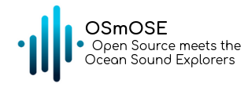

<div align="center">

  
</div>


[![Continuous integration][ci-badge]][ci-link]
[![Code style: black][black-badge]][black-link]
[![][coverage-badge]][coverage-link]
[![Python version: 3.10.9][python-ver]][python-link]

[ci-badge]: https://github.com/Project-OSmOSE/osmose-toolkit/actions/workflows/github-ci.yml/badge.svg
[ci-link]: https://github.com/Project-OSmOSE/osmose-toolkit/actions/workflows/github-ci.yml
[black-badge]: https://img.shields.io/badge/code%20style-black-000000.svg
[black-link]: https://github.com/psf/black
[coverage-badge]: https://project-OSmOSE.github.io/osmose-toolkit/coverage/badge.svg
[coverage-link]: https://project-OSmOSE.github.io/osmose-toolkit/coverage
[python-ver]: https://img.shields.io/badge/python-3.10+-blue.svg
[python-link]: https://www.python.org/downloads/release/python-3100/

# OSmOSE Project

The Open Science meets Ocean Sound Explorers is a collaborative research project aiming to develop a complete collection of FAIR acoustic analysis tools and methods. This project wishes to harmonize the practices in underwater passive acoustic studies, especially regarding data sharing and reproducibility. Another focus is the ease of development and accessibility for new collaborators. We know that each team has different needs that requires tailoring their tools themselves.

The project is made of this python toolkit and the web annotation platform [Aplose](https://osmose.ifremer.fr/app).

## Presentation

The OSmOSE toolkit is an open source collection of tools dedicated to the management and analysis of passive underwater acoustic data. Written in python, it is can be used either as a framework for your analyses, a tool integrated in your workflow or an end-to-end analysis suite. 
Among other key features, our toolkit has been adapted to be deployed on a cluster infrastructure; below you will find installation procedures using the [DATARMOR](https://www.ifremer.fr/fr/infrastructures-de-recherche/le-supercalculateur-datarmor) cluster of IFREMER, on which our production version runs.

## For users

### Quick start  in local

Users will be interested in the stable versions of our toolkit, which are released on a regular basis and are available [here](https://github.com/Project-OSmOSE/osmose-toolkit/releases/tag/v0.1.0). We discourage users to install the toolkit from our git repository, as it is under permanent development and thus potentially unstable and unfinished.

### Quick start on DATARMOR

The newest stable version can be directly used within a Jupyter Hub session of Datarmor by setting the kernel to `osmose`. A set of "getting started" Jupyter notebooks are available from our datawork `/home/datawork-osmose/osmose-datarmor`, which covers basic use cases from your dataset uploading to first AI model development. To access the Datarmor cluster, you will need a user account, which may be provided upon request (please contact dorian.cazau@ensta-bretagne.fr).
 


## For developers

### Contribution workflow

1. Install locally our toolkit (see section **Local installation** below);

2. Start by reviewing our Github [issues](https://github.com/orgs/Project-OSmOSE/projects/6), get in touch with our developer team to obtain an account, and propose new issues anytime following standard procedures (in particular, among other must-have: short description, assignees, status, label...);

3. Develop and validate locally your contribution. Please follow standad github procedures such as developing on a new branch built from our main branch; no pushes will be accepted on our main repository. We recomend the use of our poetry-based editable conda environment to ease the development process.

4. If intended to be deployed on Datarmor, please see section **Contribution on Datarmor** below;

5. Once validated, commit and push your branch to our Github project and create a pull-request so it can be properly peer-reviewed. 
 

### Local installation

1. First, create an empty git repository in a newly created folder and clone this repository.

```bash
git init

git clone https://github.com/Project-OSmOSE/osmose-toolkit.git
```

2. Create a Conda virtual environment in python 3.10.

```bash
conda create --name osmose python=3.10 -y
conda activate osmose
```

3. Install poetry and use it to install the package.

```bash
conda install poetry
poetry install
```

Note: if `poetry install` fails with the message ``ImportError: cannot import name 'PyProjectException'``, run this line instead:

```bash
conda install -c conda-forge poetry==1.3.2
```

The package is installed in editable mode! You can now call it just like any regular python package as long as you are in the environment.

```python
import OSmOSE as osm

dataset = osm.Dataset()
```

Note that it is installed in editable mode, meaning that any change made to the package's file will be reflected immediately on the environment, without needing to reload it. 


### Contribution on Datarmor

To develop and/or test your code contributions on Datarmor, use the local git repository located at `/home/datawork-osmose/osmose_toolkit_dev/`; the corresponding editable conda environment is named `osmose_dev`. To update yourself this local repository, you can use the following `osmose_activate` alias:

```csh
echo "alias osmose_activate='cd /home/datawork-osmose/osmose_package; git checkout main; git pull origin main; . /appli/anaconda/latest/etc/profile.d/conda.sh; conda activate /home/datawork-osmose/conda-env/osmose_dev/; cd -'" >> .bashrc
```

After reloading your shell, from now on typing 
```bash
bash
osmose_activate
``` 
will:

- Update the local package to the latest version.

- Activate the conda environment.

- Update or install any dependency that is not present.

## License

This program is free software: you can redistribute it and/or modify it under the terms of the GNU Affero General Public License as published by the Free Software Foundation, either version 3 of the License, or (at your option) any later version. See [LICENSE](LICENSE) for the complete AGPL license